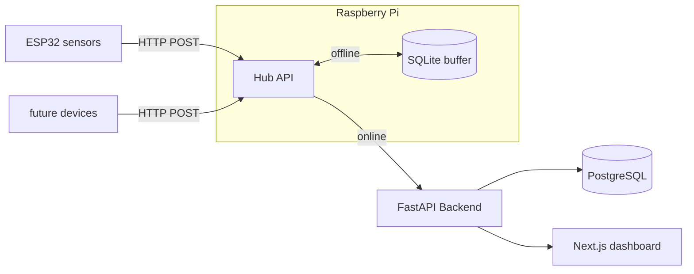

# cabin-iot

Personal home automation system intended for cabin usage.

## Planned Architecture

## Stack

- **Backend** — FastAPI, SQLModel, PostgreSQL 
- **Frontend** — Next.js
- **Hub** — FastAPI on Raspberry Pi (planned), SQLite buffer for offline resilience
- **Device** — Arduino MKR WiFi 1010 + ENV shield, ESP32 (planned)

## Status
-  In progress
